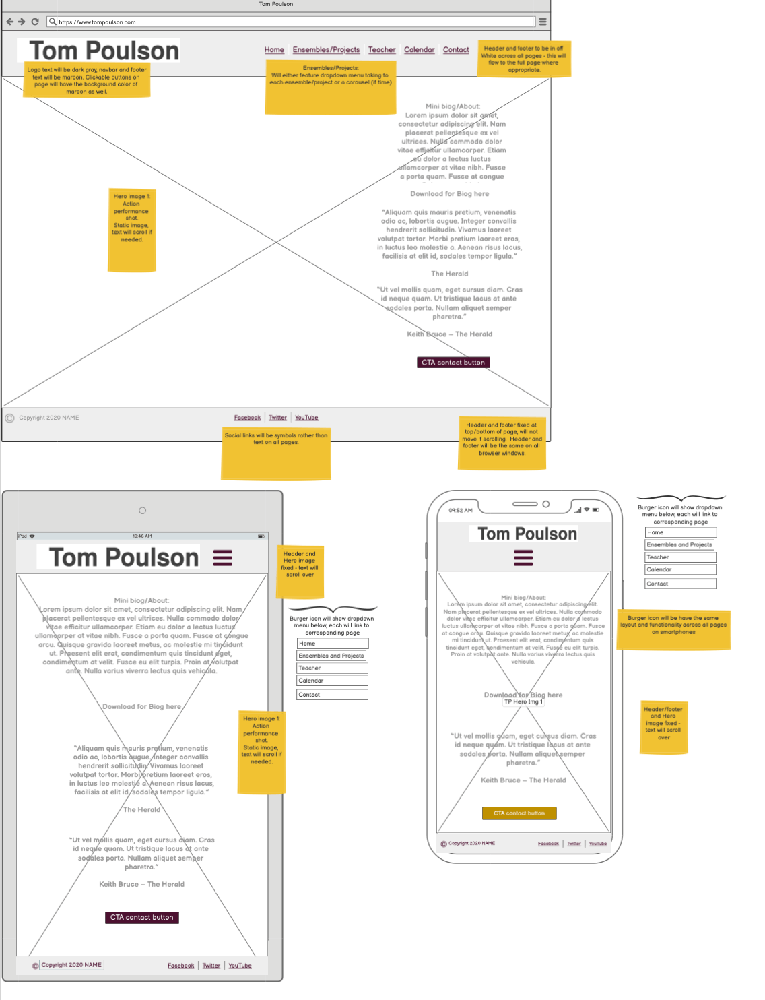
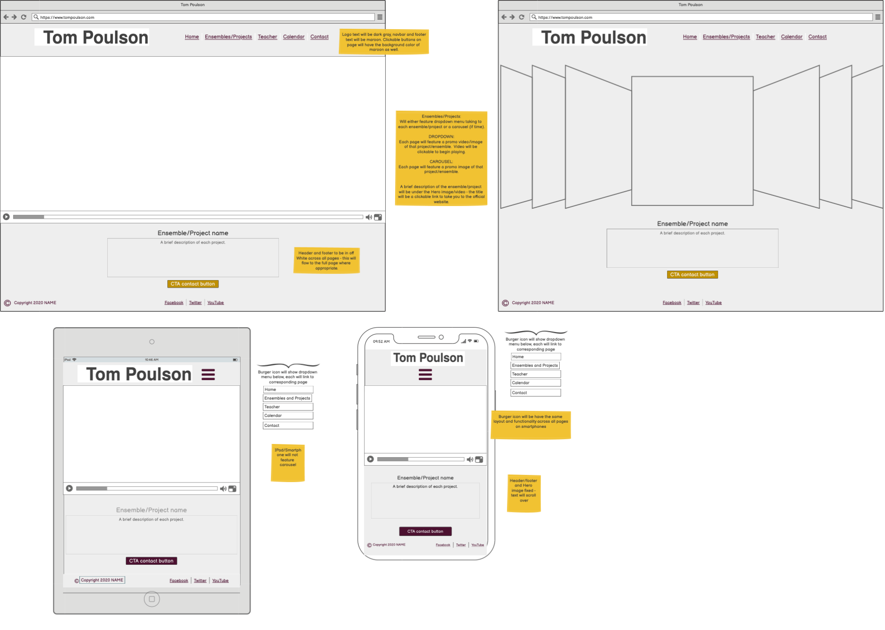
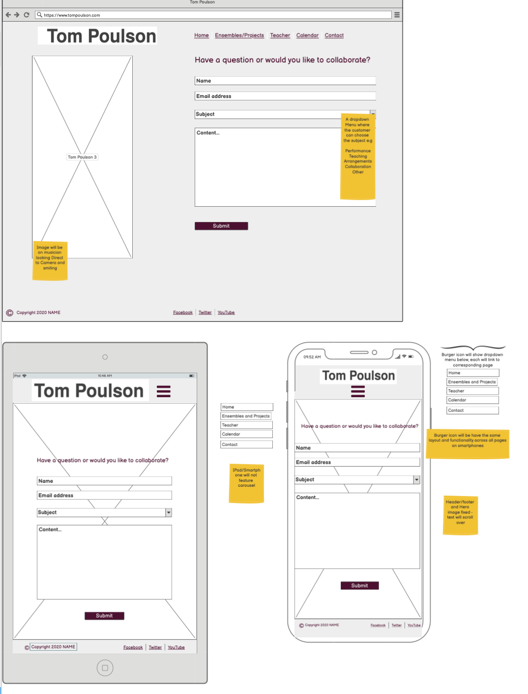

# Tom Poulson #

## Trumpeter, Teacher and Arranger ##

[Tom Poulson - website](http://cairi-s.github.io/tom-poulson)

This is a full website for classical/contemporary trumpeter, Tom Poulson.  Tom is from England but currently lives in Stockholm, Sweden, and is active around the world.

The website will feature promotional images of both solo and ensemble performances, reviews of concerts, links to external webpages of his groups and projects and a contact page to lead potential collaborators to make contact with Tom.

It is worth noting that, as a performer, this website is **aimed at both B2B and B2C clients**:
- B2B are professional orchestras, music clubs and music schools who may be looking for a performer or teacher.
- B2C would be private individuals looking to for a performer at private functions and events.

With this in mind the website is designed to be **easily navigated,responsive and accessible** on a variety of different devices.

The business goals of the website are:
- To increase brand awareness.
- To provide exceptional UX to encourage users to book the musician for performances.
- Provide examples of the musicians range of work to showcase versatility.
- Encourage users to make contact with the musician with all queries.

Customers to this website may be looking to:
- Book a solo musician or an ensemble for concerts.
- Collaborate on a new project.
- Enquire about other topics such as teaching for individual lessons or masterclasses in a higher education setting. 

The customer goals are:
- A clear, easy to navigate website showcasing the performer.
- Easy means of Communication with the musician.

## UX ##

Ideal client:
- English speaking.
- Is an individual looking for a musician for a private event.
- Are an orchestra or music group looking to collaborate on a project.
- Is an individual with a keen interest/knowledge in classical and contemporary music.

Why this project is important:
- As classical musicians often work across multiple areas their websites can often quickly overload the user with too much information.
- This website aims to break down the different areas the musician works within to clear, accessible areas so the user can quickly navigate to the section they are interested in whilst also encouraging them to continue browsing the website.

First Time Visitor Goals:
- Visiting the site for the first time, I want to discover more about the musician and find reviews of their concerts to see if I should consider making a booking.
- Visiting the site for the first time, I want to be able to navigate the site quickly and effectively to find what I need.
- Visiting the site for the first time, I am looking for clearly documented experience to know if I should consider making a booking.

Returning Visitor Goals:
- As a Returning Visitor, I want to easily navigate to the Contact page to enquire about the musicians availability.
- As a Returning Visitor, I want to find up to date testimonials and reviews of the performers work.
- As a Returning Visitor, I want to find links to ensembles and projects that the musician is a part of to see their range.

Potential Collaborator Goals:
- As a Potential Collaborator, I want to be able to contact the musician quickly with any questions I have.
- As a Potential Collaborator I want to be able to find clear examples of the types of projects the musician participates in to know if they would be a suitable collaborator.
- As a Potential Collaborator, I want to find links to the musicians social media channels to check they are actively performing.

## DESIGN ##

**Colour Scheme**

The three main colours I am proposing are:
- Off white - reflects the refined style expected from a classical musician.
- Dark gray  - reflects the refined style expected from a classical musician.
- Maroon - adds a splash of color and ties in with a color on the home page hero image.

**Fonts**

Selected fonts are used with thanks to [Google Fonts](https://fonts.google.com/).  They are easy for the user to read and are complimentary to one another.
- Poppins - Used in the header and footer plus and headings within the main body.
- Raleway - Used for text within the body.

**Imagery**

All Hero images used will mainly be action shots of the musician performing/teaching.  
- The **Home page** will feature a dynamic image of the performing as a soloist.
- The images used on the **Ensembles and Projects** page be promotional images showcasing a specific group or project.
- The image on the **Contact page** will feature the musician smiling and looking to camera, to convey that he is approachable.

## WIREFRAMES ##

Please note the navigation menu featured in the wireframe reflects additional pages and features that could be added in the future.

- HOME PAGE

- ENSEMBLES AND PROJECTS PAGE

- CONTACT PAGE

## FEATURES ##

The **header** for each page will be conventional with the logo in the top left hand corner and navigation bar to the right.   The logo will be in dark gray with the navbar in maroon.

The **footer** for each page will include copyright information and links the the musicians social media centered shown by icons.  These will be in maroon.

When you **hover over an item in the navbar** the text will be outlined by a box - the text and background color will invert so the text is off-white and the box is maroon.

The **Home and Contact pages** will feature a different Hero images aimed to showcase the area of that pages focus - these pictures will be action photos with the hope of giving energy to the webpage and giving a positive emotional response toward the site and the musician.

### **Home** ###

The **Hero image** will be static with a text box featuring a mini biography on the right, within this text box the user be prompted to **download full biography** via a button. Three seperate **reviews** of recent performances will be featured above the footer. On mobile phones the hero image will be static while the text scrolls over the image. 

The **download button** will feature a download icon and **open to a pdf in a new tab**.

On **iPad and Mobile devices** only the two more prestigious reviews will be featured to reduce scroll time and stop the potential for information overload.

As part of the footer there will be a **Call to Action** button directing users to the **Contact page** should the user have already decided that they want to make contact with the musician.

### **Ensembles and Projects** ###

A major part of this musicians work is through solo projects and playing with other ensembles - many of these are prestigious in themselves and users may be looking to find out more information about these projects, therefore it is necessary to highlight them in their own page.  

This page will feature a **carousel** of images with captions showcasing each ensemble or project the musician is involved in.

Each ensemble or project mentioned will feature a **title**, a description of the Group and **photograph** showcasing their music. 

Each **title** will be a **link to an external website** which will **open in a new Tab**.

Photographs or images used will be promotional shots used by each group or project for cohesiveness should the user seperately search for that ensemble or project.

There will also be a **Call to Action button** asking the user if they want to collaborate and directing users to the **Contact page**.

### **Contact** ###

The **hero image** will be of the musician smiling to camera to showcase their warm personality and hopefully encourage collaboration.

Centered on the page will be a **contact form**. 

Everyone wanting to make an enquiry must provide their: 
- Name.
- Contact email address.
- A message.  

The page concludes with a **submit button**.

## EXISTING FEATURES ##

**Header Logo** - Appears on every page making the brand easily identifiable. The logo will react as users have come to expect - clicking on it will return them to the Home screen.

**Header Navigation Bar** - Appears on every page and creates quick and easy navigation to all areas of the website.  The page that the user is currently visiting is easily identifiable by being underlined.  When the user moves to select a different page the mouse position will be hightlighted by inverting the background and text colors.

**Footer Copyright Information** - Appears on every page to protect the business copyright.

**Footer Social Icons** - Appears on every page to guide the user toward the musicians social media profiles.  The icons will link to the relevant social media and open in a seperate tab.

**Call to Action Buttons** - Appear on every page to encourage users to reach out to the musician, hopefully improving business opportunities.  The buttons will link to the Contact and open in a seperate tab.

**Images** - All images chosen are dynamic images with the aim of providing an emotional response.

**Home Page** - Gives potential collaborators an initial 'hit' of knowledge about the musician without overloading them with information.  

**Download button** - Users are provided the opportunity to learn more about the musician via a download button linking to a pdf of the musicians full biography.

**Ensembles and Projects page** -  Users are able to learn more about the groups and projects that the musician is a part of to discover whether they musician would make a suitable partner for a collaboration.

**Contact Page** - Allows potential collaborators to ask questions, and/or make an initial enquiry in to the musicians availability.

## FUTURE FEATURES ##

- GDPR pop up.
- CAPTCHA.
- Language choice (English/Swedish).
- High quality videos of past performances.
- Addition of pages - teaching, arrangements and calendar.
- Ability to take bookings for lessons/performances on website.
- Abitilty to accept payments for bookings/music purchases on website.

## TECHNOLOGY ##

This project uses the programming languages:
- HTML
- CSS

This project was built using [Gitpod](https://www.gitpod.io/)

The creation of this website would not have been possible without:
- [Balsamiq](https://balsamiq.com/) - used for creation of Wireframes.
- [Bootstrap4](https://getbootstrap.com/docs/4.0/getting-started/introduction/) -  used for their navbar, grid system and carousel.
- [Google Fonts](https://fonts.google.com/) -  used for fonts styles, namely Poppins and Raleway.
- [Font Awesome](https://fontawesome.com/) - used for icons, namely the Download icon on the home page.
- [Color Tool](https://material.io/resources/color/#!/?view.left=0&view.right=0&primary.color=560027&secondary.color=E0E0E0) - used to select complimentary colors for the website design.
- [Tinypng](https://tinypng.com/) - used to reduce the file size of all images.
- [Online-Convert.com](https://image.online-convert.com/convert-to-jpg) - used for converting jpeg to jpg files.
- [AutoPrefixer.github.io](http://autoprefixer.github.io/) - used for CSS prefixing.
- [jQuery](https://jquery.com/) - used to reference JavaScript for responsiveness and functionality on navbar and carousel.
- [Popper.js](https://popper.js.org/) - used to reference JavaScript for responsiveness and functionality on navbar and carousel.

- The W3C Markup Validation service - HTML and CSS validators.

## TESTING ##

- [W3C Markup Validation service](https://validator.w3.org/) - used to check validity of website HTML code.  No errors or warnings reported.
- [W3C CSS Validation service](https://jigsaw.w3.org/css-validator/validator) - used to check validity of website CSS code.  No errors or warnings reported.

**Client Stories Testing**

The most common path users take through the website is:

Home > Ensembles and Projects > Contact

Each of these pages has a natural progression to the next. Should the user get to the bottom of the page and decide they wish to make contact with the musician each page features an easily identifiable button which links directly to the contact page so they do not have to scroll back to the top.

To reduce information overload on the Home page, the information about the musician has been reduced to an exciting headline.  The user is able to learn more by downloading a full Biography using the easy to idetify Download button which opens in a seperate tab.

The Ensembles and Projects page features links to the external websites of each group or project which open in a seperate tab.  The text chosen for each group is designed to display the standard and flexibility of range that the musician has without detracting from them as a soloist.  The text and external links aim to entice the user to read more.  

**Testing client stories from UX section**

First Time Visitor Goals:
- Visiting the site for the first time, I want to discover more about the musician and find information on the artist and reviews of their concerts to see if I should consider making a booking.
    * The Home page has a clean, simplistic layout.  
    * The Hero image clearly shows the instrument the musician plays with the falling letters creating intrigue and interest.  
    * The About text on the Home page is short and concise detailing the accolades the musician has achieved without overloading the user with unnecessary information - a PDF of the musicians full biography available to download via a clearly visible button.
    * The reviews, taken from recent performances, are short and display the musicians musicality.  They clearly show the musicians artistry and are taken from reputable sources. 

- Visiting the site for the first time, I want to be able to navigate the site quickly and effectively to find what I need.
    * On every page the navigation bar is easy to find and use.  The page the user is visiting is underlined and an active hover function on the navigation bar shows where the user is potentially navigating to.
    * On every page the Logo, situated in the top left of the header, navigates back to the home page which is customary on most websites. The home page is the starting point for most user stories.
    * Each page features a Call to Action button inviting users to contact the musician, clicking this button leads them directly to the Contact page. 

- Visiting the site for the first time, I am looking for clearly documented experience to know if I should consider making a booking.
    * The About text on the Home page quickly demonstrates accolades the musician has achieved.
    * The Reviews featured on the home page reference the musicians artistry and musicality directly.
    * The Ensembles and Projects page showcases the highly sought after groups the musician is a member of and the unique projects the musician has helped develop.

Returning Visitor Goals:
- As a Returning Visitor, I want to easily navigate to the Contact page to enquire about the musicians availability.
    * Each page can access the contact page quickly and easily either via the navbar at the top of the page or via the Call to Action button further down the page.
- As a Returning Visitor, I want to find up to date testimonials and reviews of the performers work.
    * The Home page has recent reviews of performances from reputable sources.  Over time these reviews will change to reflect more recent performance reviews.
- As a Returning Visitor, I want to find links to ensembles and projects that the musician is a part of to see their range.
    * The Ensembles and Projects page has clear promotional imagery of each group or project.  Each page links externally to that group/projects webpage - these open in a seperate tab.

Potential Collaborator Goals:
- As a Potential Collaborator, I want to be able to contact the musician quickly with any questions I have.
    * No matter which page the user arrives to the site the are able to make quick contact with the musician via contact page either via the navbar at the top of the page or via the Call to Action button further down the page.
- As a Potential Collaborator I want to be able to find clear examples of the types of projects the musician participates in to know if they would be a suitable collaborator.
    * The Home page details the musicians capabilities as a soloist while the Ensembles and Projects page shows the different ensemble sizes that the musician is used to performing with (5 musicians and 10 musicians) as well as non-standard instrumentation (performances including choreography, acting and electronics).  Over time this page will be updated to include additional ensembles and projects to further showcase the musicians artistry.
- As a Potential Collaborator, I want to find links to the musicians social media channels to check they are actively performing.
    * The footer of every page includes links to the musicians active social media channels.  Each link opens in a seperate tab so the user does not need to navagate away from the website. 

**Manual testing of all elements and functionality on every page.**

HOME PAGE

*Logo*

- Hover over logo and ensure there is no discernable change to the logo other than the pointer turning to a hand.
- Click logo and ensure it links to the "Home" page

*Navigation bar*

- Navigate between the "Home", "Ensembles and Projects" and "Contact" page from a desktop and confirm each links to the corresponding page.
- Change the screen size to mobile device to verify that the navigation bar is responsive and switches from inline menu to burger icon dropdown menu at the appropriate breakpoint.
- Hover over each menu item in the navigation bar to check that the text and background color invert.
- Check that the appropriate menu item is underlined to show the active page (in this instance 'Home').
- Click on the logo in the navigation bar and verify that it links to the home page.

*Hero image*

- Reduce and expand width of window to confirm that the overlay on top of image responds correctly.

*About text*

- Reduce and expand width of window to confirm that the text in this section responds correctly and looks good on all device widths.
- Check the text for spelling and grammar errors.

*Download Button*

- Hover over the download button to ensure that the text changes from sentence case to uppercase and becomes underlined.
- Click the button on both desktop and mobile devices and check that the PDF download opens in a new window.

*Reviews*

- Reduce and expand the width of the window to ensure that the number of reviews on display changes from three to two when changing from desktop to mobile screen size.
- Check the text for spelling and grammar errors.

*Call to action button*

- Hover over the download button to ensure that the text changes from sentence case to uppercase and becomes underlined.
- Click the call to action button and confirm that it links to the contact page.

*Footer*

- Hover over each social media icon and confirm the pointer changes to a hand icon as expected.
- Click on each icon to ensure they open on the expected social media page.
- Make the window width smaller and larger to ensure responsiveness.

ENSEMBLES AND PROJECTS PAGE

*Logo and Navigation bar*

- Repeat the steps listed for the home page.
- Check the HTML code is the same between ensembles.html and index.html

*Stockholm Chamber Brass page*

- Check image covers the page and all group members are visible.
- Click groups title and check it links to the Stockholm Chamber Brass external website in seperate tab.
- Check text for spelling and grammar errors.
- Click 'here' to check that this links to the Stockholm Chamber Brass Academy external website in a seperate tab.

- Hover over the call to action button to ensure that the text changes from sentence case to uppercase and becomes underlined.
- Click the call to action button and confirm that it links to the contact page.
- Reduce the screen size to a mobile breakpoint to ensure the call to action button moves from the text box to the footer.

- Hover over both the right and left carousel navigation buttons to ensure their opactiy changes.
- Click both the right and left carousel navigation buttons to ensure their opacity changes.

*The above steps were repeated on 'The Last Post' and 'WorldBrass' carousel pages*

*Footer*

- Repeat the steps listed for the home page.
- Check the HTML code matches index.html.

CONTACT PAGE

*Logo and Navigation bar*

- Repeat the steps listed for the Home and Ensemble and Projects pages.

*Hero image*

- Verify the image covers the full width and height of the desktop and responds appropriately when the screen size is reduced.

*Contact form*

- Attempted to submit the form without completing any fields - relevant error message appears.
- Attempted to submit the form using an email address excluding an @ sign - relevant error message appears.
- Attempted to submit the form without a message - relevant error message appears.

*Footer*

- Repeat the steps listed for the Home and Ensemble and Projects pages.

MOBILE RESPONSIVENESS 

- Each page was tested using [Google DevTools](https://developers.google.com/web/tools/chrome-devtools) to ensure it looks good and reacts as expected on all listed devices.

**Further testing**

- I invited friends and family to view the site on their devices and report any issues they find.  Devices used included:
    * MacBook
    * MacBook Air 
    * MacBook Pro 
    * iPad
    * iPad Pro
    * Samsung S20
    * Samsung J6
    * iPhone 6S
    * iPhone XR
    * iPhone SE 
    * Pocophone F1 Mio 
    * Xiaomi Mi 10T Lite 

- Reported bugs/glitches included:
    * Mobile phones - a lag on the scroll on the home page.  Noone reported this greatly impacted the use of the website, some reported they were only aware of it after it had been brought to their attention.  No action has been taken to rectify this.

**Bugs**

- White band at the bottom of mobile devices on Ensemble page.  

Solution: changing the chosen images from landscape images to portrait images.  Changing position of contact button on this page between desktop and mobile devices.

## DEPLOYMENT ##

This project was developed using [Gitpod](https://www.gitpod.io/), committed to git and pushed to GitHub using the built in functionality.

**Publishing**

This website was published using GitHub Pages. The procedure is outlined below.

1. Go to the **[GitHub](https://github.com/)** website and log in.
2. On the top right hand corner **click the dropdown icon** next to your avatar, and **select 'Your repositories'**. 
3. **Select the appropriate repository** (for this project the repository would be 'tom-poulson').
4. The header of your chosen repository will have a menu of different pages you can select (you automaticall should be on 'Code').  **Click on 'Settings'** located on the far right hand side.
5. **Scroll down** until you see the heading **'GitHub Pages'**. 
6. Under the subheading 'Source' there is a **dropdown menu titled 'Branch'** - click on this and **select 'master branch'**. 
7. The page will reload and you will see the **link of your published page displayed within a green banner** under 'GitHub pages'.  The text will say 'Your site is published at *website*' (in this instance https://cairi-s.github.io/tom-poulson/).
8. **Please note** it can take a few minutes for the site to be published, you must wait until the 'GitHub pages' banner turns green before trying to open the link.

## CREDITS ##

- **Tom Poulson** for all text used on this website.
- **Neil Hanna Photography** for use of his press photograph of 'The Last Post' used on the Home page.
- **Ed Poulson** for his help with editing images on photoshop.
- **Miki Anagrius** for use of his photograph of Stockholm Chamber Brass used on the Ensembles and Projects page.
- **Anna Parker @ Fogbank Projects**  for use of their poster designed for promotion of project The Last Post used on the Ensembles and Projects page.
- **Peter Himsels** for use of their photograph of WorldBrass used on the Ensembles and Projects page.
- **Kenneth Dundas** for use of their photograph of the musician smiling during rehearsal used on the Contact page.
- **Sebsemillia** for .carousel-caption code on StackOverflow to align captions to center of page *credited on style.css*
- My mentor, **Akshat Garg**, for his help and guidance throughout.
- **Code Institute tutors and staff** for their easy to access course material.
- The wonderful **Code Institute Slack community**.
- The **StackOverlow community**. 